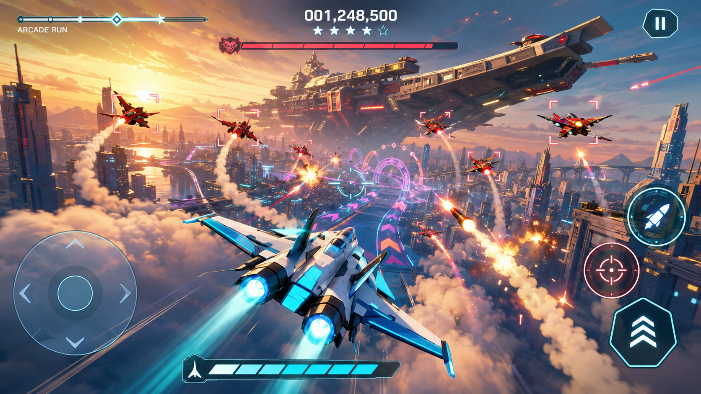

# Arcade Run product reference

This generated concept frame is the visual target for Arcade Run. It is not
rendered directly in the game; the live scene recreates its hierarchy with
mobile-safe Three.js geometry and effects.

- Large cyan-and-white hero fighter in a close chase camera
- Golden-hour coastal megacity, river, skyline layers, mountains, and cloud deck
- Giant airborne carrier used as the climax-target silhouette
- Multiple enemy depth layers with crisp multi-lock brackets
- Curved missile trails, speed streaks, layered explosions, and debris energy
- Cyan and magenta route gates with a minimal safe-area HUD
- Landscape iPhone controls: flight pad on the left, FIRE / LOCK / TURBO on the right

The authored route remains deterministic and branches across eleven visual
biomes, while each seven-section run is paced to roughly two minutes.

## Implementation checkpoint — 2026-08-30

The reference reconstruction includes the beveled hero fighter and airborne
carrier, streamed city blocks with facade windows and a river, layered clouds
and sunlight, pooled missile trails/explosion effects, a bounded HDR composite,
and the compact combat HUD. Portrait and landscape camera framing use the same
camera-pose function tested against the actual airframe vertices.

The flight stick uses its visible center and a radial dead zone. Pointer release,
capture loss, pause, window blur, page hiding and orientation changes release
controls. Arcade Run and Stage Practice are isolated from the existing Turbo
Hunt renderer and overlays; the title keeps both game modes available.

## Completed visual verification — 2026-08-31

The V2 reference-quality pass was verified with an automated 844 x 390 iPhone-
landscape WebGL play sequence. The audit enters Arcade Run from the real title
screen, captures opening flight, banked climb, combat/lock activity and Turbo,
and rejects missing WebGL, undersized render surfaces, browser console errors
or page errors.

The final audit completed successfully with a 1350 x 624 WebGL backing surface,
no console errors and no page errors. CI tests, lint and production artifact
verification also passed, and the same revision deployed successfully to GitHub
Pages.

A visual audit exposed an InstancedMesh capacity overflow introduced while
adding taller hero-building spires. The spire pool now has bounded capacity for
the authored instances, and the regression suite asserts that every rendered
InstancedMesh count remains inside its instance-matrix capacity. The resulting
Dawn City capture has the intended full-width skyline, river corridor, golden-
hour depth, readable cyan/white fighter, enemy layers, route guidance and Turbo
presentation without the previous giant undefined-geometry obstruction.

Keep this implementation in the GitHub source as well as the existing Site.
A later source sync must not remove Arcade Run or its WebGL reference audit.
